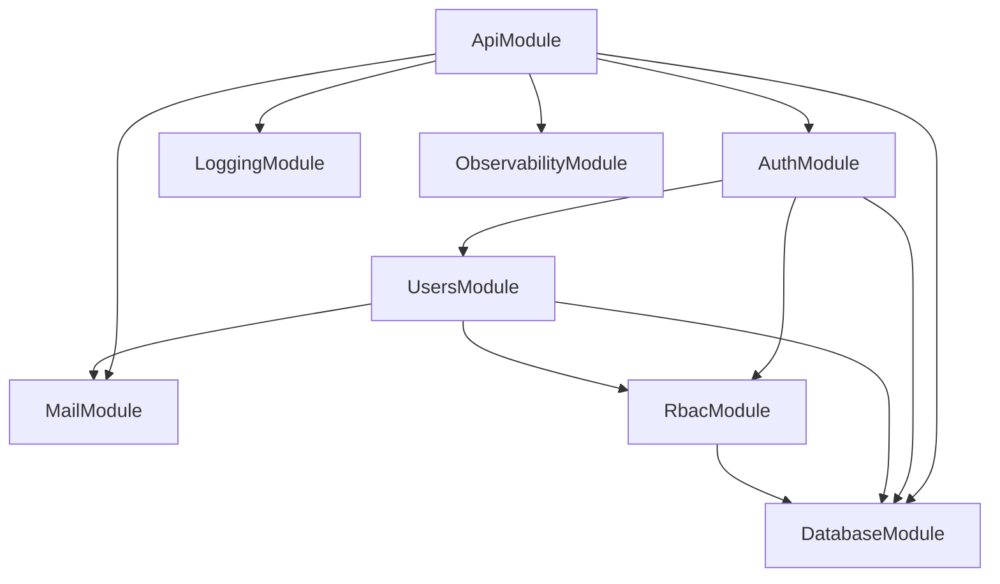
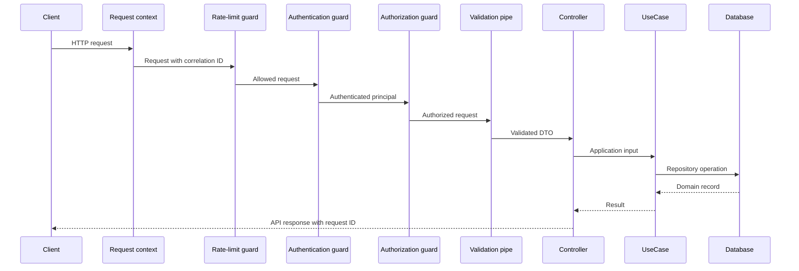

# Architecture

The project is one NestJS application and one deployment unit. Business
capabilities are separated into modules, while database, configuration,
logging, mail, and HTTP contracts live in shared infrastructure libraries.

## Module map



`ApiModule` is the composition root. `AuthModule` imports the user and RBAC
modules and registers the global authentication and authorization guards.
`UsersModule` calls RBAC through a port, while cross-module consumers use
exported public services rather than infrastructure classes.

## Business modules

| Module  | Responsibility                                                                                                     |
| ------- | ------------------------------------------------------------------------------------------------------------------ |
| `auth`  | Credentials, JWT access tokens, refresh sessions, cookies, CSRF, and authentication endpoints                      |
| `users` | Registration records, profiles, email verification, password hashing, account status, and administrative lifecycle |
| `rbac`  | Roles, permissions, assignments, overrides, effective access, authorization guard, and audit records               |

Each business module follows the same broad structure:

```text
src/
├── application/      Use cases, contracts, ports, policies, and assemblers
├── domain/           Business constants, enums, services, and errors
├── infrastructure/   Persistence, security, mail, and cross-module adapters
├── presentation/     HTTP controllers, DTOs, guards, and decorators
├── public/           Narrow services exported to other modules
└── *.module.ts       NestJS composition
```

Not every module needs every directory. Add a layer only when the capability
requires it.

## Shared modules

| Library                | Responsibility                                                                                   |
| ---------------------- | ------------------------------------------------------------------------------------------------ |
| `shared/common`        | API response contracts, Problem Details, pagination, request decorators, and OpenAPI composition |
| `shared/config`        | Typed environment schema and cross-field production validation                                   |
| `shared/database`      | Global TypeORM connection, CLI data source, and migrations                                       |
| `shared/logging`       | Winston transports, request context, correlation IDs, and HTTP completion logs                   |
| `shared/mail`          | SMTP transport and Handlebars template configuration                                             |
| `shared/observability` | Public liveness and readiness endpoints                                                          |

## Request lifecycle



The actual path varies for public endpoints and endpoints without permission
requirements:

1. `RequestContextMiddleware` accepts or creates an `X-Request-Id`.
2. The global throttler applies the configured rate limit.
3. `AccessAuthGuard` skips public routes or validates the JWT access token.
4. `AuthorizationGuard` enforces permission metadata when present.
5. The global validation pipe transforms input, removes no unknown fields
   silently, and returns a `422` error when validation fails.
6. Controllers call application use cases and assemble the HTTP response.
7. `ProblemDetailsFilter` normalizes failures.
8. `RequestLoggingInterceptor` records method, path, status, and duration.

## Dependency rules

- Presentation code may call application use cases.
- Application code depends on contracts and ports, not HTTP or ORM details.
- Infrastructure implements persistence, cryptography, mail, and module
  adapters.
- Cross-module access goes through exported public services and adapter-bound
  ports.
- Shared libraries must not depend on business-module internals.
- Database changes are expressed through migrations, never runtime
  synchronization.

## Repository layout

```text
apps/api/                   Application bootstrap and setup
apps/api/test/              End-to-end test suite
libs/modules/auth/          Authentication module
libs/modules/users/         Users module
libs/modules/rbac/          RBAC module
libs/shared/common/         Shared HTTP behavior
libs/shared/config/         Environment validation
libs/shared/database/       Database connection and migrations
libs/shared/logging/        Logging and request context
libs/shared/mail/           Mail transport
libs/shared/observability/  Health checks
scripts/                    RBAC and administrator seed scripts
docker/                     Container initialization assets
logs/                       Rotated runtime logs
```

## Adding a capability

Prefer extending the module that owns the behavior. A new business capability
should become a new module only when it has a distinct model and lifecycle.
Expose the smallest public service needed by other modules, register new ORM
entities with `TypeOrmModule.forFeature`, and create an explicit migration for
schema changes.

Continue with [Database and Migrations](./database-and-migrations.mdx) for the
schema workflow and [API Overview](./api-overview.mdx) for HTTP conventions.
