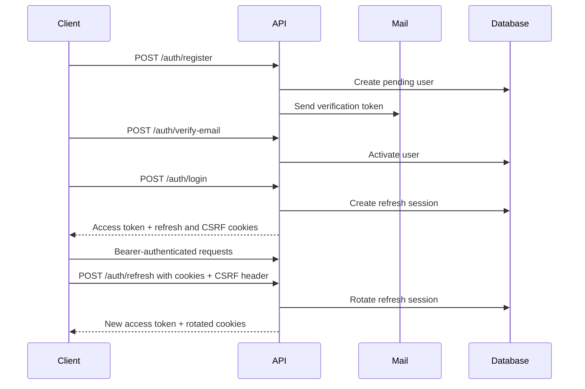

# Authentication

Authentication combines short-lived JWT access tokens with server-tracked,
rotating refresh sessions:

- The access token is returned in the response body and sent with
  `Authorization: Bearer <token>`.
- The refresh token is stored in a configurable HTTP-only cookie.
- A readable CSRF cookie and matching `X-CSRF-Token` header protect
  cookie-authenticated state-changing requests.
- Refresh-token hashes, not raw refresh tokens, are stored with session
  metadata.
- Reusing a rotated refresh token revokes the compromised session.

All routes below use the default base URL `http://localhost:3000/api/v1`.

## Authentication lifecycle



## Register and verify an account

Register:

```bash
curl --request POST http://localhost:3000/api/v1/auth/register \
  --header 'Content-Type: application/json' \
  --data '{
    "email": "user@example.com",
    "displayName": "Example User",
    "password": "replace-with-a-strong-password"
  }'
```

Registration accepts passwords from 8 to 128 characters, creates a
`PENDING_VERIFICATION` account, and sends a verification email. The route is
limited to five requests per minute.

Submit the token from the email:

```bash
curl --request POST http://localhost:3000/api/v1/auth/verify-email \
  --header 'Content-Type: application/json' \
  --data '{
    "token": "verification-token-from-the-email"
  }'
```

Request another message when verification is still pending:

```bash
curl --request POST http://localhost:3000/api/v1/auth/resend-verification \
  --header 'Content-Type: application/json' \
  --data '{
    "email": "user@example.com"
  }'
```

The resend endpoint returns `202 Accepted` without revealing whether a usable
account exists.

## Log in

Use a cookie jar so the refresh and CSRF cookies are retained:

```bash
curl --request POST http://localhost:3000/api/v1/auth/login \
  --header 'Content-Type: application/json' \
  --cookie-jar cookies.txt \
  --data '{
    "email": "user@example.com",
    "password": "replace-with-a-strong-password"
  }'
```

A successful response contains:

```json
{
    "success": true,
    "statusCode": 201,
    "message": "Login successful.",
    "data": {
        "accessToken": "<jwt>",
        "csrfToken": "<csrf-token>",
        "accessExpiresIn": 900,
        "user": {
            "id": "<user-uuid>",
            "email": "user@example.com",
            "displayName": "Example User",
            "role": {
                "id": "<role-uuid>",
                "key": "USER",
                "name": "User",
                "isSystem": true,
                "isSuperAdmin": false
            },
            "status": "ACTIVE",
            "emailVerifiedAt": "2026-01-01T00:00:00.000Z",
            "createdAt": "2026-01-01T00:00:00.000Z",
            "updatedAt": "2026-01-01T00:00:00.000Z",
            "deletedAt": null
        }
    },
    "timestamp": "2026-01-01T00:00:00.000Z",
    "requestId": "<request-uuid>"
}
```

Use the returned access token for protected resources:

```bash
curl http://localhost:3000/api/v1/users/me \
  --header 'Authorization: Bearer <access-token>'
```

Login is limited to ten requests per minute. Suspended, deleted, and unverified
accounts cannot authenticate.

## Obtain a CSRF token

Clients that need a CSRF token before login can request one:

```bash
curl http://localhost:3000/api/v1/auth/csrf \
  --cookie-jar cookies.txt
```

The response returns the token in `data.csrfToken` and sets the corresponding
cookie. Send the same token in `X-CSRF-Token`.

## Refresh a session

The refresh request uses the HTTP-only refresh cookie plus the CSRF cookie and
header. It has no JSON body:

```bash
curl --request POST http://localhost:3000/api/v1/auth/refresh \
  --cookie cookies.txt \
  --cookie-jar cookies.txt \
  --header 'X-CSRF-Token: <csrf-token>'
```

The API rotates both tokens, updates the session metadata, returns a new access
token, and writes the new cookies. Replace the previous CSRF and access tokens
after every successful refresh.

Treat a `401` refresh response as an ended session. The refresh token may be
missing, expired, invalid, revoked, or detected as reused.

## CSRF rules

The CSRF guard compares:

1. The configured CSRF cookie.
2. The `X-CSRF-Token` request header.

Both must be present and equal. The following authentication operations require
CSRF:

| Operation               | Additional authentication |
| ----------------------- | ------------------------- |
| Refresh                 | Refresh cookie            |
| Log out current session | Refresh cookie            |
| Log out all sessions    | Bearer access token       |
| Revoke a session        | Bearer access token       |

Bearer-only operations do not rely on cookies for authentication and therefore
do not automatically require CSRF.

## Manage sessions

List active sessions:

```bash
curl http://localhost:3000/api/v1/auth/sessions \
  --header 'Authorization: Bearer <access-token>'
```

The result includes session IDs, expiry and activity timestamps, IP address,
user agent, and whether each entry is the current session.

Revoke one session:

```bash
curl --request DELETE \
  http://localhost:3000/api/v1/auth/sessions/<session-uuid> \
  --header 'Authorization: Bearer <access-token>' \
  --header 'X-CSRF-Token: <csrf-token>' \
  --cookie cookies.txt
```

Revoke every session:

```bash
curl --request POST http://localhost:3000/api/v1/auth/logout-all \
  --header 'Authorization: Bearer <access-token>' \
  --header 'X-CSRF-Token: <csrf-token>' \
  --cookie cookies.txt
```

Changing the password also revokes all sessions:

```bash
curl --request POST http://localhost:3000/api/v1/auth/change-password \
  --header 'Authorization: Bearer <access-token>' \
  --header 'Content-Type: application/json' \
  --data '{
    "currentPassword": "current-password",
    "newPassword": "new-password-at-least-12-characters"
  }'
```

## Cookie deployment requirements

Authentication cookies:

- Use the configured `SameSite` value.
- Use the configured global prefix and `/v1/auth` as their path.
- Mark the refresh cookie as HTTP-only.
- Require `Secure` in production.

If a browser frontend is hosted on another site, use
`AUTH_COOKIE_SAME_SITE=none`, `AUTH_COOKIE_SECURE=true`, HTTPS, credentialed
CORS requests, and a permitted `CORS_ORIGINS` value.

See [Configuration](./configuration.mdx) for all token and cookie settings and
[API Overview](./api-overview.mdx) for error contracts.
