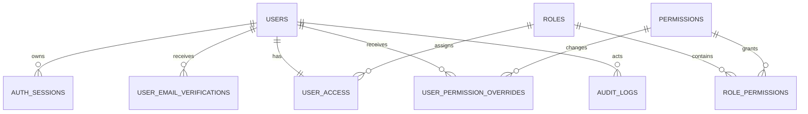

# Database and migrations

The application uses PostgreSQL through TypeORM. Runtime synchronization and
automatic migration execution are disabled:

```text
synchronize: false
migrationsRun: false
```

Every schema change must be represented by an explicit migration.

## Connection behavior

The API connection:

- Reads `DATABASE_URL`.
- Enables verified TLS when `DATABASE_SSL=true`.
- Uses `DATABASE_POOL_SIZE` as the maximum pool size.
- Adds `APP_NAME` as PostgreSQL's `application_name`.
- Retries connection up to ten times with a three-second delay.
- Rejects `null` or `undefined` values in TypeORM where conditions.

The TypeORM CLI data source loads `.env.test` when `NODE_ENV=test`; otherwise it
loads `.env`. It discovers:

- Entities at
  `libs/modules/**/infrastructure/persistence/entities/*.orm-entity.ts`.
- Migrations in `libs/shared/database/src/migrations`.
- Migration history in `typeorm_migrations`.

## Data model



Primary records:

| Table                       | Purpose                                                                                                          |
| --------------------------- | ---------------------------------------------------------------------------------------------------------------- |
| `users`                     | Identity, normalized email, password hash, status, authentication version, verification state, and soft deletion |
| `user_email_verifications`  | Hashed registration and email-change tokens with expiry and consumption state                                    |
| `auth_sessions`             | Refresh-token hash, absolute expiry, activity metadata, revocation state, IP, and user agent                     |
| `roles`                     | System and custom roles                                                                                          |
| `permissions`               | System and custom permission definitions                                                                         |
| `role_permissions`          | Role-to-permission assignments                                                                                   |
| `user_access`               | One role assignment per user                                                                                     |
| `user_permission_overrides` | Per-user `ALLOW` and `DENY` changes                                                                              |
| `audit_logs`                | Before/after RBAC mutation records                                                                               |

The first migration enables PostgreSQL `pgcrypto` for UUID generation.

## Inspect and apply migrations

```bash
pnpm migration:show
pnpm migration:run
```

Status meanings:

- `[X]`: already recorded as applied.
- `[ ]`: pending.

`migration:run` applies pending migrations in a transaction. It does not create
migrations and does not rerun applied files.

## Create a manual migration

Use a manual migration for data changes, renames, triggers, functions, partial
indexes, complex checks, or PostgreSQL-specific SQL:

```bash
pnpm migration:create \
  libs/shared/database/src/migrations/add-project-ownership
```

Implement both `up()` and `down()`, review the destructive impact, and then
apply it:

```bash
pnpm migration:run
```

## Generate from entity differences

The generator compares current entity metadata with the database selected by
`DATABASE_URL`:

```bash
pnpm migration:generate \
  libs/shared/database/src/migrations/add-user-timezone \
  --pretty
```

The positional argument must contain both a directory and migration name.
These are wrong:

```bash
pnpm migration:generate libs/shared/database/src/migrations
pnpm migration:generate run
```

Preview SQL without creating a file:

```bash
pnpm migration:generate \
  libs/shared/database/src/migrations/check-schema \
  --pretty \
  --dryrun
```

## Review generated migrations

Before applying generated code:

1. Read the complete `up()` and `down()` methods.
2. Confirm renames were not represented as destructive drop-and-create
   operations.
3. Check indexes, unique constraints, foreign keys, defaults, and check
   constraints.
4. Add manual SQL for data movement, functions, triggers, seeds, and partial
   indexes.
5. Confirm `DATABASE_URL` targets the intended database.

TypeORM entity metadata does not represent every PostgreSQL schema feature.
Generated output is a draft, not an approval.

## Revert the latest migration

```bash
pnpm migration:revert
```

This executes `down()` for the most recently applied migration. Review it first:
a revert may delete tables, columns, or data.

## Migration rules

- Never edit or remove a migration already applied to staging, production, or a
  shared database.
- Add a new migration to change an existing schema.
- Renaming an entity class or file does not rename its table.
- TypeORM does not compare migration checksums. Editing an applied file does not
  make it pending.
- Reset only disposable development databases.

## Reset a development database

**This procedure deletes all tables, data, functions, triggers, and migration
history. Never use it for staging, production, shared, or valuable databases.**

For native PostgreSQL, first verify the target:

```sql
SELECT current_database(), current_schema(), inet_server_addr(), inet_server_port();
```

Then reset the schema:

```sql
DROP SCHEMA public CASCADE;
CREATE SCHEMA public AUTHORIZATION postgres;
```

Use the actual database role instead of `postgres` when required, then apply
migrations:

```bash
pnpm migration:run
pnpm migration:show
```

For the included Docker Compose database:

```bash
docker compose down -v
docker compose up -d postgres mailpit
pnpm migration:run
```

`docker compose down` without `-v` keeps `postgres-data`; the database and
migration history remain intact.

See [Troubleshooting](./troubleshooting.mdx) for common TypeORM and connection
failures.
