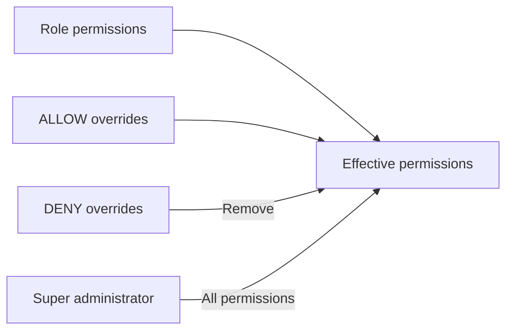

# Role-based access control

RBAC combines one role assignment per user with optional per-user permission
overrides. The authentication guard resolves effective access into the
authenticated principal, and the authorization guard enforces required
permissions.

All RBAC administration endpoints require both a bearer token and
super-administrator access.

## Seeded roles

`pnpm seed:rbac` and `pnpm seed:admin` maintain three system roles:

| Key           | Purpose                                                         |
| ------------- | --------------------------------------------------------------- |
| `SUPER_ADMIN` | Protected break-glass role with unrestricted application access |
| `ADMIN`       | Manages the user lifecycle without RBAC administration access   |
| `USER`        | Default role assigned to application users                      |

The seed also creates the system user-management permissions and assigns them
to `ADMIN`. A PostgreSQL trigger assigns `USER` to new user records.

## Seeded permissions

| Key             | Purpose                                        |
| --------------- | ---------------------------------------------- |
| `users.create`  | Create managed users                           |
| `users.read`    | List and inspect managed users                 |
| `users.update`  | Update managed users and request email changes |
| `users.delete`  | Soft-delete managed users                      |
| `users.restore` | Restore soft-deleted users                     |

Custom permission keys must use dot-separated lowercase segments, such as
`projects.read` or `billing.invoices.approve`. Role keys use uppercase letters,
digits, and underscores, beginning with an uppercase letter.

## Effective permissions

For a normal user, access is calculated in this order:

1. Start with the permissions assigned to the user's role.
2. Add every user override with effect `ALLOW`.
3. Remove every user override with effect `DENY`.
4. Sort and return the unique keys.



A super administrator receives every known permission and cannot have
per-user overrides.

## Role operations

Base path: `http://localhost:3000/api/v1/rbac/roles`

| Method and path                   | Purpose                                      |
| --------------------------------- | -------------------------------------------- |
| `GET /rbac/roles`                 | List roles with pagination and search        |
| `POST /rbac/roles`                | Create a custom role                         |
| `GET /rbac/roles/:id`             | Get a role and its permissions               |
| `PATCH /rbac/roles/:id`           | Update a role's name or description          |
| `DELETE /rbac/roles/:id`          | Delete an unused custom role                 |
| `PUT /rbac/roles/:id/permissions` | Replace the complete assigned permission set |

Create a role:

```bash
curl --request POST http://localhost:3000/api/v1/rbac/roles \
  --header 'Authorization: Bearer <super-admin-access-token>' \
  --header 'Content-Type: application/json' \
  --data '{
    "key": "SUPPORT_AGENT",
    "name": "Support Agent",
    "description": "Handles customer support workflows"
  }'
```

Replace its permissions:

```bash
curl --request PUT \
  http://localhost:3000/api/v1/rbac/roles/<role-uuid>/permissions \
  --header 'Authorization: Bearer <super-admin-access-token>' \
  --header 'Content-Type: application/json' \
  --data '{
    "permissionIds": ["<permission-uuid>"]
  }'
```

This is replacement semantics: omitted permission IDs are removed.

## Permission operations

Base path: `http://localhost:3000/api/v1/rbac/permissions`

| Method and path                | Purpose                                  |
| ------------------------------ | ---------------------------------------- |
| `GET /rbac/permissions`        | List system or custom permissions        |
| `POST /rbac/permissions`       | Create a custom permission               |
| `GET /rbac/permissions/:id`    | Get a permission                         |
| `PATCH /rbac/permissions/:id`  | Update name or description               |
| `DELETE /rbac/permissions/:id` | Delete an unreferenced custom permission |

Create a permission:

```bash
curl --request POST http://localhost:3000/api/v1/rbac/permissions \
  --header 'Authorization: Bearer <super-admin-access-token>' \
  --header 'Content-Type: application/json' \
  --data '{
    "key": "projects.read",
    "name": "Read projects",
    "description": "View project records"
  }'
```

Filter the list with `type=SYSTEM` or `type=CUSTOM`. Both role and permission
lists also accept the standard `page`, `limit`, and `search` query fields.

## Assign user access

Base path: `http://localhost:3000/api/v1/users/:id/access`

Get the current assignment, role permissions, overrides, and effective
permissions:

```bash
curl http://localhost:3000/api/v1/users/<user-uuid>/access \
  --header 'Authorization: Bearer <super-admin-access-token>'
```

Replace the complete assignment:

```bash
curl --request PUT http://localhost:3000/api/v1/users/<user-uuid>/access \
  --header 'Authorization: Bearer <super-admin-access-token>' \
  --header 'Content-Type: application/json' \
  --data '{
    "roleId": "<role-uuid>",
    "overrides": [
      {
        "permissionId": "<permission-uuid>",
        "effect": "DENY"
      }
    ]
  }'
```

The `overrides` array is also replacement-based. Each permission may appear
once.

## Safeguards

- Only super administrators can administer RBAC.
- System roles and permissions are protected from destructive changes.
- A role referenced by users cannot be deleted.
- A permission referenced by roles or overrides cannot be deleted.
- Callers cannot replace their own access.
- The last active super administrator cannot be demoted or made unavailable.
- Super-administrator assignments cannot include overrides.
- All referenced role and permission UUIDs must exist.

## Audit records

RBAC mutations record:

- Actor user ID.
- Action and target type.
- Target UUID.
- Before and after JSON values.
- Request ID when available.
- Creation timestamp.

List audit records:

```bash
curl \
  'http://localhost:3000/api/v1/rbac/audit-logs?page=1&limit=20&action=ROLE_UPDATED' \
  --header 'Authorization: Bearer <super-admin-access-token>'
```

Additional filters are `actorUserId`, `targetType`, `targetId`, `dateFrom`, and
`dateTo`.

Read [User Management](./user-management.mdx) for permission-protected user
operations and [API Overview](./api-overview.mdx) for pagination and errors.
